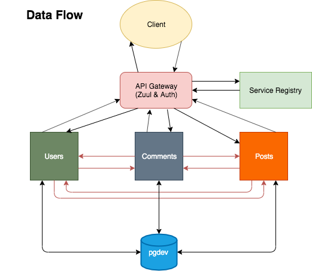

# Reddit-Clone-Microservices
**Front-end**: @ToddS1 & @magfurulabeer || **Back-end microservies**: @stevencharleshuang & @ntuvera
 

### Technologies Used:
- Spring Boot: Framework for microservices
- Spring Boot Web
- Spring Boot Security
- Spring Cloud Starter Netflix Eureka Client/Server
- Spring Cloud Starter Netflix Ribbon/Hystrix/Zuul Proxy
- OpenFeign:  Microservice Communication
- JSON WebToken: Specific method for stateless Security
- JPA & Hibernate :Relational Mapping and JDBC handler
- Flyway DB: Migrations
- Postgresql: database used
- Maven: Dependency Manager

### General Approach
To start we began by planning and diagramming our ERD and Microservice architecture.  After the initial mock-up we started by writing our Project planning using PivotalTracker with a combination of User Stories and Tasks.  The goal was to map out and replicate the expected endpoints and returns.  After the first day of planning we took a few days to research, the best ways to implement interservice communication.  Given that the backend was a originally built as a monolith, the focus was to split it into microservices based on their main model.  While it is built on a single Postgres DB, by ensuring separation of the services and applying OpenFeign, the database will be able to be split into separate db's down the line.  

The initial database was setup with migrations using Flyway, to greater control over how the data is handled.  By manually handling the relations between models, it gave us granular control and allowed us to later be able to split a singular database into multiple.  The auhtorization is handled via JSON WebTokens which are generated on the user microservice and authorization gatewayed through our api-gateway.  The separation of concerns was further implemented by FeignCalls, by being REST calls to the separate microservices, they are more standalone in nature.  Also if there is a a failure between posts and/or comments, they can be handled more gracefully (and will be in the future).

After confirming matching endpoints and getting similarly formatted returns (follow the original pattern with more optional data).  We then moved forward to testing the front-end against our newly built microservice back-end.  At this point, the focus was on ensuring the front-end worked seamlessly with the new back-end, essentially replacing the orginal monolithic back-end.  Given the front-to-back-end contract, with the correct endpoints/returns, we had to solve any configuration issues to ensure the api calls worked smoothly.  Finally, since we were able to check our API with Postman and reviewing raw HTTP requests we then had to finish handling CORS between the front-end and back-end.

### Major Hurdles and Challenges Faced
One of the first major hurdles we had to overcome was implementing Authentication and Authorization between microservices.  Previously we've only built monolithic applications which only would employ having a single node to hit, so setting up a pre-filter gateway to that made sense.  We initially were going to keep all auth on the user microservice which would end up coupling posts and comments to users more tightly.  But by separating the generating of auth to the user service, which usually was hit first, but then allowing the gateway to do the check, every call would be made separate from the user service after the initial authentication through users.

Another major hurdle we faced was our erd and database.  At initial planning it seemed straight forward, however we used flyway to migrate our tables from the beginning.  This allowed to decouple our tables in theory, but we had to make up for it in the code.  The main challenge was trying to compensate for relationships that were usually provided to us easily by hibernate.  Foreign key ids in hiberate could be used to easily reference other "embedded" objects and would be less code.  However, by generating our own Object Beans and making feign calls we were able to individually create missing entities and append them to the the returns we expected, even add more if we chose to, such as generating the User Object in all Post and Comment returns.

Additionally, a large amount of time was spent attempting to deploy our application to Pivotal Cloud Foundry. One of the biggest obstacles of this project was time spent on rebuilding the services between configurations and code debugs, even with caching implemented. Also, a lot of minor bugs were introduced due to configuration issues or dependency versions. It was a valuable lesson learned to be meticulous about code and configurations.

### Pivotal Tracker _(for planning and organizing tasks)_
https://www.pivotaltracker.com/n/projects/2417719

### ERD

### Microservice Architecture

### API Endpoints
|          Description         |        Endpoint        | Method |
|:----------------------------:|:----------------------:|:------:|
|            Sign Up           | /signup                |  POST  |
|            Log In            | /login                 |  POST  |
|        Create Comment        | /comment/{postId}      |  POST  |
|   List Comments By Post ID   | /post/{postId}/comment |   GET  |
|   List Comments By User ID   | /user/comment          |   GET  |
| Delete Comment By Comment ID | /comment/{commentId}   | DELETE |
|          Create Post         | /post                  |  POST  |
|          List Posts          | /post/list             |   GET  |
|      List Posts By User      | /user/post             |   GET  |
|    Delete Post By Post ID    | /post/{postId}         | DELETE |
|      Create User Profile     | /profile               |  POST  |
|       Get User Profile       | /profile               |   GET  |
|        Update Profile        | /profile               |  POST  |

### How to Run Project

Starting the API and microservices
1. Pre-requisite: have `Docker`, `Maven` installed
2. `git clone git@github.com:ntuvera/spring-boot-microservices.git`
3. `cd spring-boot-microservices`
4. `docker-compose up` (and wait for the build, it may take a while)
5. Check to see that the api is up by going to `http://localhost:8671`

Launching the front-end(Using JetBrains IntelliJ)
1. `git clone git@github.com:ToddS1/Reddit-Clone-with-Backend-P2.git`
2. In IntelliJi *File>Open ...>* locate folder created by clone and click Open
3. (Assuming you have a Tomcat Apache server) Under *Run> Edit Configurations* 
4. Click the `+` and select Tomcat Server > local.  Set your Application to your local install of Apache Tomcat.  
5. Under the `Deployment` tab, under _Deploy at server startup_, click the `+`and select artifact.
6. Select `reddit-clone-api:war exploded`
7. Optional Step: change application context to `/` to be able to access the server directly from http://localhost:8080 (instead of localhost:8080/reddit_clone_api_war_exploded)
8. Click Ok.  
9. Under the Run Menu, click `Run Tomcat version number`
10. Access the API either through postman endpoints or through the index.html page in the `P1_source` folder

### Backlog
- Improve on exception handling
- Implement Hibernate instead of Flyway
- Write integration and unit tests
